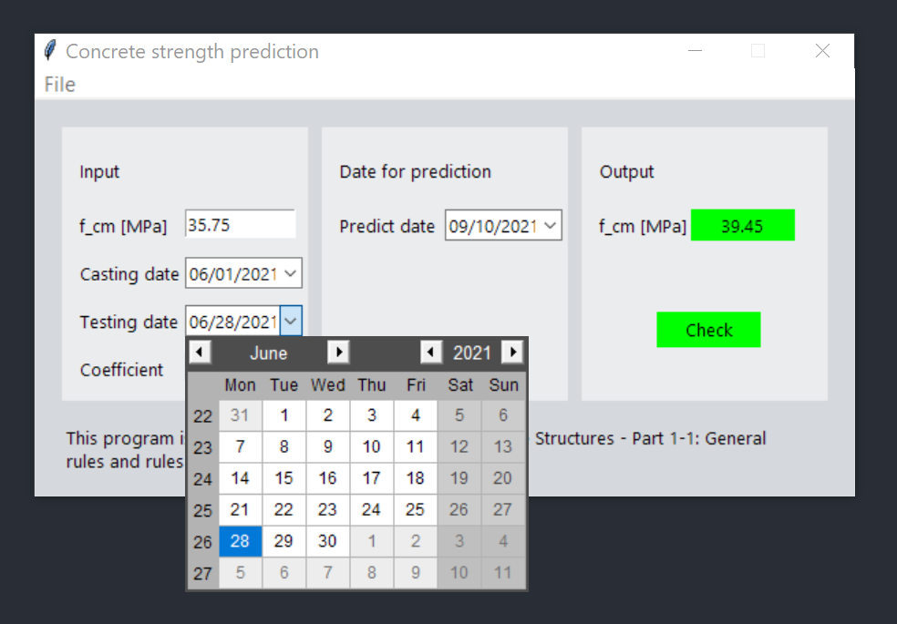

Thank you for downloading this program!

# Download

If you are busy, please quickly access the executable file here: [Quick access](https://github.com/MiladSoltanalipour/concrete_strength_prediction/releases/tag/V1.0)

# How the program works

This program predicts the concrete compressive strength depending on its age.

It is based on Eurocode-2 Design of Concrete Structures - Part 1-1: General rules and rules for buildings, Clause 3.1.2 part (6). According to this clause, the concrete compressive strength is estimated if the following 3 items are available:

Mean concrete compressive strength at 28 days, Age of the concrete in days, and Coefficient depending on the cement type.

This program has a calendar widget that makes your prediction easy.

If you like to see how the program is written, I encourage you to check out the source code which is available here: [Source code](CSP.py)

Thank you for your time and contribution.

# License

[MIT](LICENSE)
